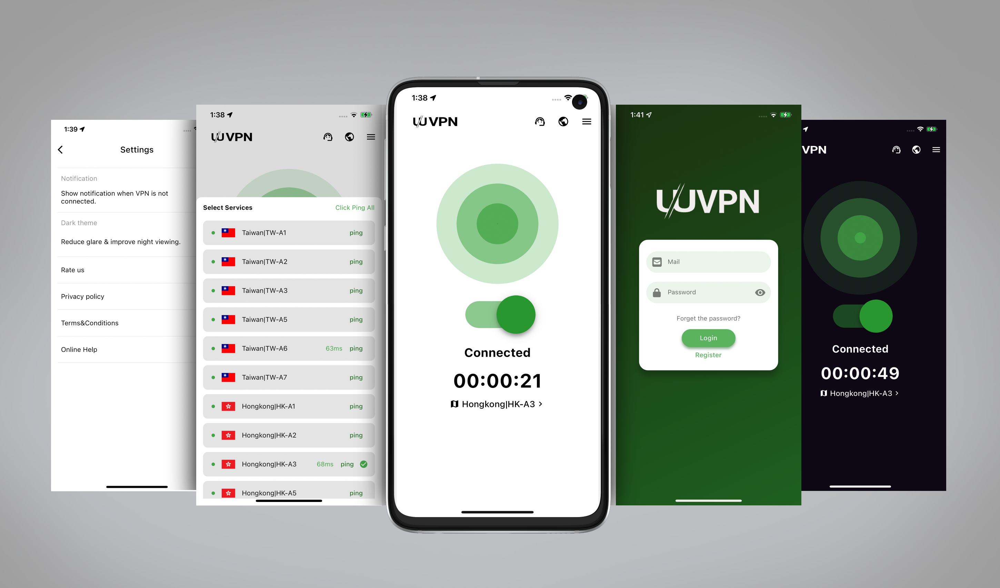

# PlukhmoonVPN
VPN client (ios/android) developed based on Flutter, self-designed, exquisite UI, optimized VPN speed, completely open source. ~~[Stop maintenance]~~

PlukhmoonVPN client (ios/android) developed based on Flutter, self-designed, exquisite UI, optimized VPN speed, completely open source. ~~[Stop maintenance]~~

[ReadME.Old](https://github.com/mohammadham/PlukhmoonVPN/blob/main/README.old.md) 

 

# 推荐 3 个开源的替代品，很强很完美 
# Recommend 4 open source alternatives, very powerful and perfect

| Feature/Aspect                  | [ClashMetaForAndroid](https://github.com/MetaCubeX/ClashMetaForAndroid)  | [sing-box](https://github.com/SagerNet/sing-box)  | [hiddify-next](https://github.com/hiddify/hiddify-next?tab=readme-ov-file)      | [Plukhmoon](https://github.com/hiddify/hiddify-next?tab=readme-ov-file)     |
|---------------------------------|------------------------------------------------------|------------------------------|-----------------------------------------|-----------------------------------------|
| **Platform**                    | Android                                              | Android, iOS, Windows, macOS and Linux          | Android, Windows, macOS and Linux platforms         | Android, iOS,                                        |
| **Interface**                   | Graphical User Interface                             | Command Line Interface       | Graphical User Interface                | Graphical User Interface                |        
| **Protocol Support**            | Clash.Meta protocols                                 | 🟡 Wide range of protocols: Vless, Vmess, Reality, TUIC, Hysteria, Wireguard, SSH etc.           | Multiple protocols                      | 🟡 Wide range of protocols: Vless, Vmess, Reality, SSH etc.              |
| **Automation**                  | Yes, via intents                                     | Limited                      | Limited                                 | Limited                      |
| **Security**                    | Moderate                                             | High                         | High                         | High                                    |
| **Performance**                 | Moderate                                             | High                         | Moderate                                             | Moderate                                |
| **Ease of Setup**               | Moderate, requires OpenJDK, Android SDK, CMake, Golang| Complex                      | Easy                                    | Easy                                    |
| **Community & Support**         | Active community, regular updates                    | Active community, limited documentation | Active community, regular updates       | Active community, regular updates       |
| **Customization**               | Limited                                              | High                         | Moderate                                | Limited                                              |
| **Main Use Case**               | Android users needing a GUI-based proxy solution     | Users needing a high-performance proxy platform | Users prioritizing privacy and ease of use | Users prioritizing privacy and ease of use |

 
 

